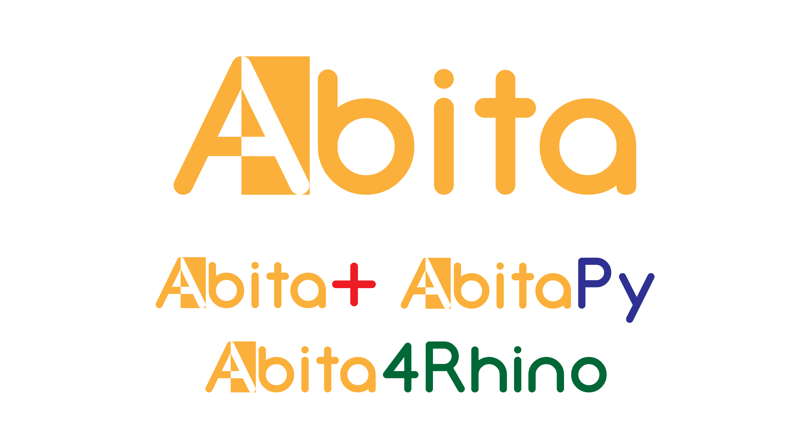

# Abita

Abita est un programme d'architecture destiné à automatiser et optimiser la
répartition de l'espace au sein d'un logement en différents lots.

## Les différents projets
* **AbitaPy** : nouveau projet Abita développé en Python (3.7), essentiellement 
    basé sur une traduction du code du Solveur d'`Abita+`. Afin d'assurer une 
    comaptibilité avec Rhino, une version en Python 2.7 est aussi disponible
    dans les releases.
* **Abita4Rhino** : version d'Abita sous forme de plugin pour Grasshopper, pour 
    Rhino. Cette version s'appuie sur le code source en python2 d'`AbitaPy`.

Pour plus de détails sur chaque projet, veuillez consulter les fichiers
`README.md` présents dans le dossier de chaque projet.

## Objectif du projet

À partir d'une liste d'**éléments** définis par l'utilisateur et représentants
un logement sous contraintes, le programme doit répartir ces éléments en 
**lots**, où chaque lot représente soit un appartement de type T1, T2, T3, 
etc..., soit un espace commun, en garantissant que tous les appartements soient
reliés à une entrée ou une sortie du logement.

Pour une configuration d'éléments donnés, le programme se charge de trouver
différentes combinaisons possibles de lot, puis de les évaluer afin de ne
conserver que les plus pertienntes.

## Auteurs

Ce projet a été réalisé par 
[Alexandre BOULANGER](https://github.com/Krotho),
[Alexis DELAGE](https://github.com/hydrielax),
[Anne-Sophie JOURLIN](https://github.com/Melpemonia),
[Lénaëlle LE ROY](https://github.com/LenaelleLR) et 
[Louis PAUTRAT](https://github.com/LouisPaut), 
étudiants à l'École Centrale de Nantes en option Informatique (2021-2022). Sous la direction de Laurent Lescop (keris-studio.fr) et Myriam Serviere (ECN)
# ABITA
